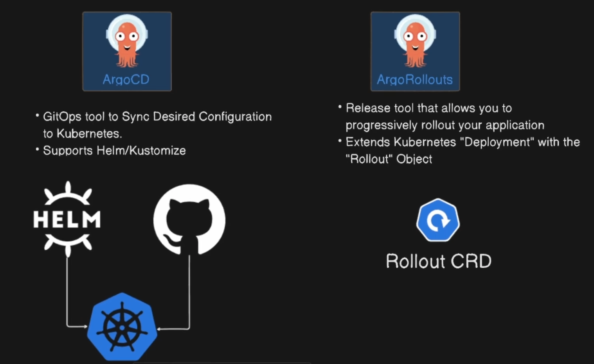

# argo-rollout

- Herramienta  de release que permite hacer rollout progresivo de tu aplicacion
- Extiende los deployments de kubernetes con el objeto rollout

## Diferencias con Argo CD
- Argo CD es una herramienta declarativa de GitOps usada para sincronizar configuraciones deseables en kubernetes
- Soporta Helm y Kustomize
- Compara los archivos del cluster con los archivos del repositorio de git
- La información de git es la fuente de la verdad
- Puede tener una sincronizacion automatica o manual
  


## GitOps
GitOps es una metodología de gestión de infraestructura y aplicaciones en la nube que utiliza Git como fuente única de verdad para la configuración y el despliegue.

En GitOps:

Todo el estado deseado del sistema (infraestructura, aplicaciones, configuraciones) se define en archivos declarativos (por ejemplo, YAML) y se almacena en un repositorio Git.
Los cambios se realizan mediante commits y pull requests en Git.
Herramientas como Argo CD o Flux observan el repositorio y sincronizan automáticamente el estado del cluster con lo que está definido en Git.
Ventajas:

Auditoría y control de cambios.
Despliegues automáticos y reproducibles.
Facilidad para revertir cambios y mantener consistencia.

## Prerequisitos

1. Minikube instalado
2. Podman instalado
3. Repositorio en github
4. brew instalado
   
## Paso a paso

1. Clonar el repositorio https://github.com/giovany79/argo-rollout

2. Crear en su cuenta de github repositorio propio con los archivos clonados

3. Ejecutar 
   
   ```
   sh scripts/setup-all.sh
   ```

4. Instalar aplicacion
   
   ```
   sh scripts/setup-app-istio-argo.sh
    ```

5. Registrar aplicación en Argo CD
   
    ```
   sh scripts/register-app-argocd.sh
    ```


## Acceder a las Consolas

### Argo CD UI
```bash
kubectl port-forward svc/argocd-server -n argocd 8080:443
```
URL: https://localhost:8080

### Argo Rollouts Dashboard
```bash
kubectl argo rollouts dashboard
```
URL: http://localhost:3100


### Aplicacion Rollout-demo

Crea tunel entre la maquina y el servicio dentro del cluster de minikube
```shell
minikube service istio-ingressgateway -n istio-system
```

Modificar el host
```shell
sudo nano /etc/hosts
```
Agregar la linea al final del archivo
127.0.0.1 rollouts-demo.local


URL: http://rollouts-demo.local:53279/

## Comandos útiles de Argo Rollouts

Consultar clave argo cd
```shell
kubectl -n argocd get secret argocd-initial-admin-secret -o jsonpath='{.data.password}' | base64 -d && echo
```

Ver el rollout
```shell
kubectl argo rollouts get rollout rollouts-demo --watch
```

Cambiar la imagen
```shell
kubectl argo rollouts set image rollouts-demo rollouts-demo=argoproj/rollouts-demo:yellow
```

Promover
```shell   
kubectl argo rollouts promote rollouts-demo
```
## Links

Getting Started Argo Rollout with istio: https://argo-rollouts.readthedocs.io/en/stable/getting-started/istio/

30 Days Of CNCF Projects | Day 9: What is Argo Rollouts + Demo:
https://www.youtube.com/watch?v=eAF1UsOqXYI

Argo Rollouts in 15 minutes!
https://www.youtube.com/watch?v=w3xdopP4aEk


ArgoCD Starter Guide: Full Tutorial for ArgoCD in Kubernetes
https://www.youtube.com/watch?v=JLrR9RV9AFA